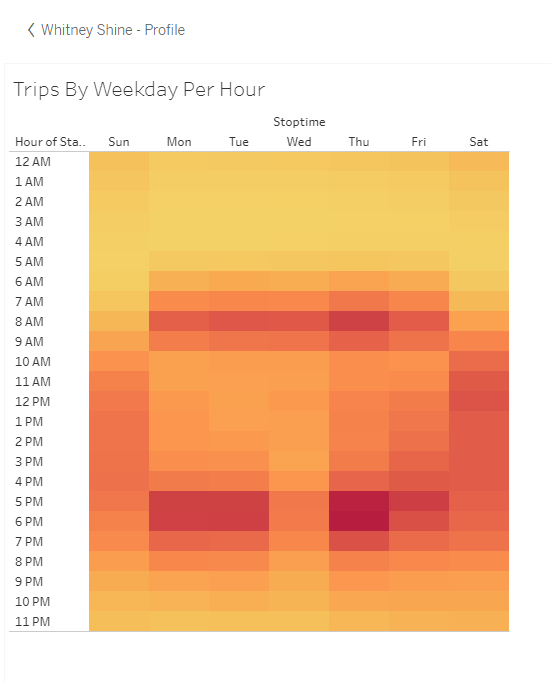

# Bikesharing  

## Background 
Now that we've gotten a good idea of how to create our story, there is still work to be done to convince investors that a bike-sharing program in Des Moines is a solid business proposal. To solidify the proposal, one of the key stakeholders would like to see a bike trip analysis.

For this analysis, I will use Pandas to change the ["tripduration"](https://github.com/whitneyshine/bikesharing/blob/main/NYC_Citibike_Challenge.ipynb) column from an integer to a datetime datatype. Then, using the converted datatype, I will create a set of visualizations to:

   * Show the length of time that bikes are checked out for all [riders](https://public.tableau.com/profile/whitney.shine#!/vizhome/NYCCitibikeChallenge_16218973329460/CheckoutTimesforUsers) and [genders](https://public.tableau.com/profile/whitney.shine#!/vizhome/NYCCitibikeChallenge_16218973329460/CheckoutTimesbyGender). 
   * Show the number of bike trips for all [riders](https://public.tableau.com/profile/whitney.shine#!/vizhome/NYCCitibikeChallenge_16218973329460/TripsByWeekdayPerHour) and [genders](https://public.tableau.com/profile/whitney.shine#!/vizhome/NYCCitibikeChallenge_16218973329460/CreatetheTripsbyGenderWeekdayperHour) for each hour of each day of the week. 
   * Show the number of [bike trips](https://public.tableau.com/profile/whitney.shine#!/vizhome/NYCCitibikeChallenge_16218973329460/UserTripsbyGenderbyWeekday) for each type of user and gender for each day of the week. 
 
 Finally, I will add these new visualizations to the two I created in this module for the [final presentation](https://public.tableau.com/profile/whitney.shine#!/vizhome/NYCCitibikeChallenge_16218973329460/NYCChallengeStory?publish=yes) and analysis to pitch to investors.  
 
## What I Have Created 
This assignment consists of two technical analysis deliverables and a written report to present the results. I have submitted the following:

  * **Deliverable 1: Change Trip Duration to a Datetime Format** 
      *  Using Python and Pandas functions, I have converted the ["tripduration"](https://github.com/whitneyshine/bikesharing/blob/main/NYC_Citibike_Challenge.ipynb) column from an integer to a datetime datatype to get the time in hours, minutes, and seconds (00:00:00). After I converted the "tripduration" column to a datetime dataytpe, I have exported the DataFrame as a CSV file to use for the trip analysis in Deliverable 2. 
  * **Deliverable 2: Create Visualizations for the Trip Analysis** 
      *  Using Tableau, create visualizations that show: 
              * How long bikes are checked out for all [riders](https://public.tableau.com/profile/whitney.shine#!/vizhome/NYCCitibikeChallenge_16218973329460/CheckoutTimesforUsers) and [genders](https://public.tableau.com/profile/whitney.shine#!/vizhome/NYCCitibikeChallenge_16218973329460/CheckoutTimesbyGender). 
              * How many trips are taken by the hour for each day of the week, for all [riders](https://public.tableau.com/profile/whitney.shine#!/vizhome/NYCCitibikeChallenge_16218973329460/TripsByWeekdayPerHour) and [genders](https://public.tableau.com/profile/whitney.shine#!/vizhome/NYCCitibikeChallenge_16218973329460/CreatetheTripsbyGenderWeekdayperHour). 
              * A [breakdown](https://public.tableau.com/profile/whitney.shine#!/vizhome/NYCCitibikeChallenge_16218973329460/UserTripsbyGenderbyWeekday) of what days of the week a user might be more likely to check out a bike, by type of user and gender. 
  * **Deliverable 3: Create a Story and Report for the Final Presentation** 
      * For this part of the Challenge, I have created a story in [Tableau](https://public.tableau.com/profile/whitney.shine#!/vizhome/NYCCitibikeChallenge_16218973329460/NYCChallengeStory?publish=yes) as well as a report that describes the key outcomes of the NYC Citibike analysis I did in the [module](https://public.tableau.com/profile/whitney.shine#!/vizhome/Module14-NYCCitibike/NYCStory) and in Deliverable 2.   

## Results  

### Checkout Times For Users 
In this visualization, I graphed the length of time that bikes are checked out for all riders. The visual shows us that most rides last between fifteen to thirty minutes. 
  

### Checkout Times By Gender 
In this visualization, I graphed the length of time that bikes are checked out for each gender.  This visual reveals that Males are the majority riders by more than 3X. 
  

### Trips By Weekday For Each Hour 
In this visualization, I graphed the number of bike trips by weekday for each hour of the day as a heatmap.  The weekdays show us two peak times - first between 7 AM - 9 AM, then between 5 PM - 6 PM. 
  

### Trips By Gender (Weekday Per Hour) 
In this visualization, I graphed the number of bike trips by gender for each hour of each day of the week as a heatmap.  The darker read indicates a high saturation - Males are really using the bikes between 5 PM - 6 PM during the week. 
  

### User Trips By Gender By Weekday 
In this visualization, I graphed the number of bike trips by gender for each hour for each day of the week as a heatmap.  Male Subscribers are showing a high usage rate during the week - a very consistent theme through our analysis using different visualizations. 
  

### 

## Summary
[Des Moines](https://worldpopulationreview.com/en/us-cities/des-moines-ia-population) is the capital and most populous city of Iowa. The five-county metropolitan region has an estimated population of 590,000, ranks 88th in the country, and frequently tops lists as one of the best cities for business and living.  Two additional visualizations I would like to see for future analysis are:  
        * **Revenue per hour by Gender and Weekday.**   We might be able to offer specials or buddy rates to increase usage during the weekday and weekends as well as do a better job of engaging the Female demographic.  
        * **Business Partners.**  Look at Businesses along our routes to see if we can partner with them for ride shares to work or even team building events that could be used to convert their workers as subscribers on a discounted rate.  
        * **Conversion rate of non-subscribers to subscribers for Females.**   We need to do a better job of promoting our services to females that would encourage them to buy in to our product and service.  
    
 As always, thank you for your time and trust on allowing me to work on this project.  Please let me know if you would like to discuss the analysis or data in further detail.

